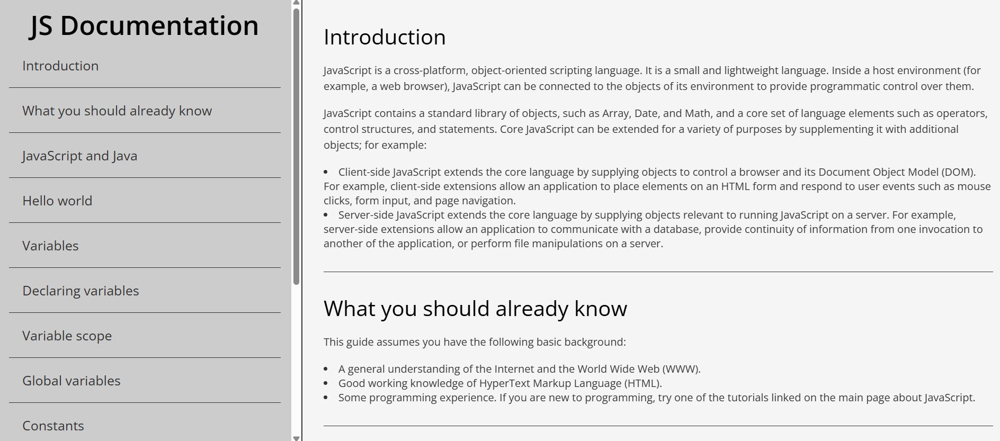

# 📁 Technical Documentation Page

## ℹ️ JavaScript Technical Reference Page

This project is a simple yet structured technical documentation page that covers core concepts in JavaScript. It includes sections such as variable declarations, data types, functions, and conditionals, formatted for readability and navigation.

It was built entirely with HTML and CSS as part of the [**freeCodeCamp.org**](https://www.freecodecamp.org/learn/full-stack-developer/) CSS course.

---

## 🔍 Overview

The page mimics a real-world developer documentation format and features a fixed navigation sidebar linking to each major section of the document. On the right, a scrollable main content area holds the detailed JavaScript topics, formatted using semantic HTML for accessibility and clarity.

The layout is fully responsive—transforming into a mobile-friendly flow for smaller screens. CSS media queries ensure the sidebar stacks properly and the content remains accessible.

---

## ✨ Features

- Fixed vertical navigation menu with internal anchor links
- Scrollable main content section using semantic HTML5
- Responsive design with media query support for smaller devices
- Structured sections with headers, code blocks, and lists
- Consistent styling and spacing for readability
- Highlights basic JavaScript concepts for learners

---

## 🧠 What I Learned

- How to build a technical documentation layout using pure HTML and CSS
- Managing fixed-position layouts and scroll margins
- Writing semantic and accessible HTML
- Styling a multi-section site with consistent spacing and contrast
- Making documentation layouts responsive for mobile users

---

## 🛠️ Tech Used

- HTML5
- CSS3

---

## 🚀 How to Run

1. Clone the repository
2. Navigate to this project folder
3. Open `index.html` in your browser

---

## 🌐 Live Demo

Or you can check out the 👉 [live website here](https://html-css-daily.netlify.app/build%20a%20technical%20documentation%20page/)

---

## 🧑‍💻 Author

Created by **Elmar Chavez**

🗓️ Month/Year: **May 2025**

📚 Journey: **2nd** month of learning _frontend web development_.
